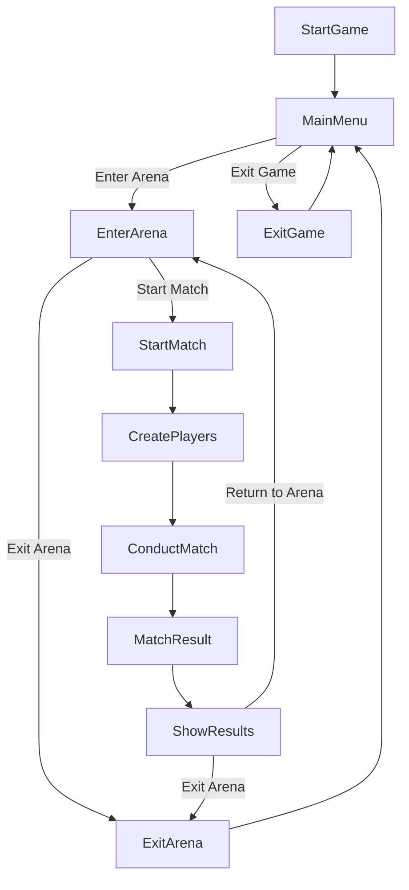

# Magical Arena

Magical Arena is a simple text-based game where players engage in magical battles. Players can create their characters with unique attributes and participate in matches against each other.

## Features

- **Player Creation**: Create custom players with unique names, health, strength, and attack attributes.
- **Match Management**: Enter the arena to engage in matches against other players.
- **Match Simulation**: Matches are simulated based on player attributes, with rounds conducted until one player's health reaches zero.
- **Color-Coded Interface**: The game features a color-coded terminal interface for better visual experience.

## Usage

Run the `main.go` file to start the game.
   ```bash
   go run main.go
   ```

## Dependencies

- This project relies on the standard Go packages for basic functionalities.
- Color-coding in the terminal interface is achieved using ANSI escape codes.


## Game workflow

